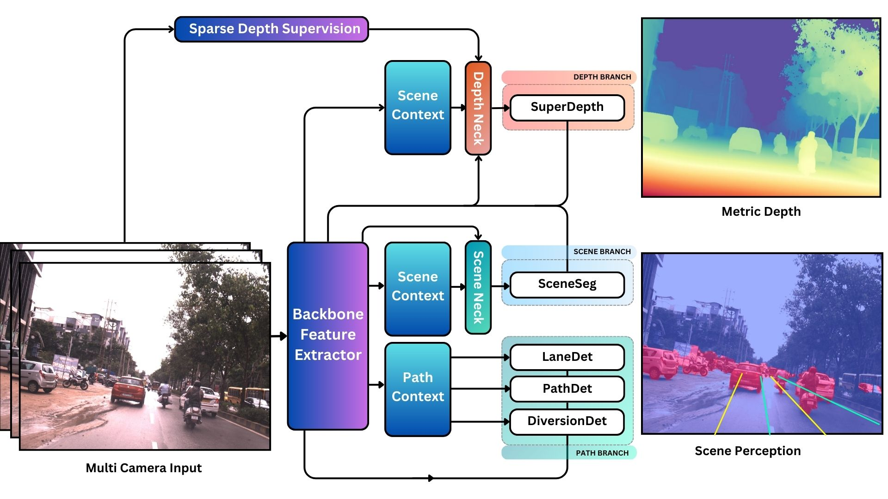

# AutoSeg

AutoSeg is an AI Foundation Model which provides real-time visual scene perception for autonomous vehicles. It utilizes a single neural network backbone to extract diverse image features, a set of context blocks which focus the network's attention on key visual elements within input images, a set of feature necks which aggregate and fuse multi-scale image features, and multiple segmentation and detection heads which provide useful perceptual outputs for autonomous decision making. Overall, the network is split into three branches, a Depth Branch which calculates the per-pixel scene depth, a Scene Branch which focuses on per-pixel scene segmentation, and a Path Branch, which focuses on driving corridor detection through multiple means.

AutoSeg has been hardened by training on a diverse set of real-world image data collected from various countries, across different road types and weather conditions.

By following an ensemble-of-experts approach, AutoSeg is able to learn generalizble features that are adaptable to out-of-domain scenarios and can facilitate multiple downstream perceptual tasks such as semantic object segmentation, lane perception, and even end-to-end autonomous driving. Furthermore, each neural expert can be independently refined and fine-tuned with additional data allowing for a richer representation of edge-case scenarios which are challenging to capture in a single predictor model.

The current AutoSeg release will comprise 4 perceptual tasks performed by different sub-neural-network experts, these include: **SceneSeg** (completed), **SuperDepth** (in-progress), **PathDet** (in-progress) and **LaneDet** (to do).

## Backbone
We utilise EfficientNetB0 as a real-time capable, high performance backbone to act as a general purpose feature extractor. EfficientNetB0 provides a very good compromise between performance and accuracy amongst state-of-the art neural network backbones. The feature backbone has 4.07M Trainable Parameters

## Context Block
Convolutional neural networks are very good feature extractors, however, they have limited ability to capture the inter-relationships and shared context of image features. Transformers on the other hand, have limited capacity at capturing fine grained image features, but excell at capture overall scene context through multi-head self attention mechanisms. The context block aims to bridge the CNN/Transformer gap by capturing channel-wise feature relationships and creating a pesudo-attention matrix which is element-wise multiplied with the input features, accompanied by a residual skip connection. The context block has 9.20M Trainable Parameters

## Neck
The purpose of the neck is to aggregate and fuse multi-scale neural network features into a rich representation. The neck is the most critical neural network block in AutoSeg since all downstream tasks are derived from a single neck block. The neck block therefore needs to be able to capture salient and generalisable feature relationships to serve downstream tasks. A Link-Net style architecture is used to upsample lower-level neural network features and skip connections are added to the neck through 1D convolutions. The neck block has 33.7M Trainable Parameters

## Shared Features
The Backbone, Context Block, and Neck are shared by the various output heads in AutoSeg and together comprise a total of 46.97M Trainable Parameters

## Head
The head is designed to process rich contextual and scene features from the neck block and process them to create a useful output based on a specific downstream task. The output heads in AutoSeg can be categorised broadly as serving two types of downstream tasks in parallel branches, a Scene Branch and a Path Branch. The Scene branch focuses on scene-level and object-level tasks, where as the path branch focuses on driving corridor related tasks. 

By focusing the majority of the neural network feature extraction and expression in upstream layers, AutoSeg is able to support multiple specialised output heads without incurring performance penalities. The head comprises the fewest number of neural network parameters in AutoSeg, with a total of 1.44M Trainable Parameters for Semantic Segmentation Tasks. The number of parameters for Detection Tasks will be even less than this number.
