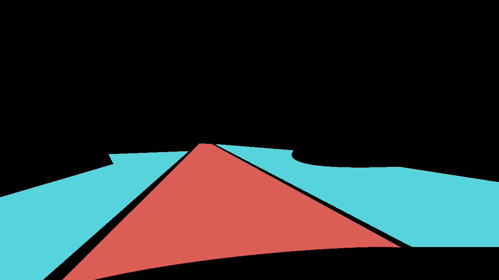

# process_bdd100k.py
## BDD100k Dataset
The script parse the [BDD100k dataset](https://dl.cv.ethz.ch/bdd100k/data/)  to create a dataset comprising input images in PNG format and a single drivable path as the ground truth, derived as the mid-line between the left/right ego lanes. 

- Data Acquisition: By Berkeley Artificial Intelligence Research (BAIR) lab, contains 100,000 (70,000 for train, 10,000 for val, and 20,000 for test) high-resolution videos and images collected from driving scenarios across various geographic locations, weather conditions, and times of the day.
- Annotation method: There are several methods but in this script, **the drivable area** is used to detect lane, and **lane detection** (polyline) is used to audit data.
- BDD100k directory structure (from download):\
There are several directories for downloading, but the necessary data is in:
    - `100k_images_train`: PNG Raw image
    - `bdd100k_lane_labels_trainval`: Lane Detection
        - `colormaps/`: lane detection with color
        - `masks/`: lane detection mask
        - `polygons/lane_train.json`: label lane detection data in training set.
    - `bdd100k_drivable_labels_trainval`: Drivable Area
        - `colormaps/`: drivable area with color (red for ego lane, blue for other lanes)
        - `masks/`: drivable area mask
        - `polygons/drivable_train.json`: label drivable area polygon in training set.
        - `rles/`: drivable area in rle format.
- Data label format:
    - `bdd100k_lane_labels_trainval/.../polygons/lane_train.json`
        ```
        {
            "name": "xxxx.jpg",
            "labels": [
            {
                "id": "n",
                "attributes": {
                    "laneDirection": "parallel",
                    "laneStyle": "solid",
                    "laneTypes": "road curb"
                },
                "category": "road curb",
                "poly2d": [
                {
                    "vertices": lane polyline
                }
                ]
            },...
        ]}

        ```
    - `bdd100k_lane_labels_trainval/.../colormaps/`
        - Red area: Ego lane
        - Blue area: other lanes
    

## Workflow

1. **Audit data** using [`utils/audit_data.py`](https://github.com/autowarefoundation/autoware.privately-owned-vehicles/blob/main/EgoPath/create_path/BDD100K/utils/audit_data.py).
    - Conditions:
        1. Red mask exists in colormap png.
        2. In lane detection json, category is not `crosswalk`
        3. In lane detection json, LaneDirection attribure is not `vertical`
    - Args:
        - `lane_json`: path to lane json file.
        - `mask_dir`: path to BDD100k drivable area colormaps.
        - `output_dir`: path to output directory where audited masks (colormaps) are collected.
        - `max_files`: optional. int value to limit number of audited masks (for testing).
    - Example
        ```
        python utils/audit_data.py --lane_json "path/to/lane/detection/json" \
                                   --mask_dir "path/to/mask/dir" \
                                   --output_dir "path/to/output/dir 
        ```
    - Structure of `output_dir`:
        ```
        --output_dir
            |----colormaps (dir that will be used to process)
            |----drivable_path_audited.json (not used)
        ```
2. **Divide audited data** in to subdirectories (is added to avoid crashing.) using [`utils/divide_directory.py`](https://github.com/autowarefoundation/autoware.privately-owned-vehicles/blob/main/EgoPath/create_path/BDD100K/utils/divide_directory.py)
    - Usage
        1. Change the path to audited data in [`utils/divide_directory.py`](https://github.com/autowarefoundation/autoware.privately-owned-vehicles/blob/main/EgoPath/create_path/BDD100K/utils/divide_directory.py)
        2. Execute `python utils/divide_directory.py`

3. **Process audited BDD100k Dataset**
    - Args:
        - `mask_dir` : str
            - path to BDD100k drivable area colormaps.
            - The directory should be directory after first audit and directory division.
        - `image_dir` : str
            - path to raw image.
        - `output_dir` : str
            - path to output directory where processed files will be stored. These dirs can either be relative or absolute.
        - `crop` : int
            - optional. Crop dimensions as [TOP, RIGHT, BOTTOM, LEFT]. Default is [0, 140, 220, 140].
    - Example
        ```
        python process_bdd100k.py \
			--mask_dir "path/to/mask/dir" \
			--image_dir "path/to/image/dir" \
			--output_dir "path/to/output/dir" \
			--crop 0 140 220 140
        ```
    - Structure of `output_dir`:
        ```
        --output_dir
            |----image
            |----segmentation
            |----visualization
            |----drivable_path.json
        ```

4. **Manually audit** the data in visualization subdirectory
    - Conditions
        1. Drivable path is correct.
        2. Drivable path is not disturbed by car bonnet and the curve road.
        3. Drivable is long enough compared to seen clear road.

5. **Reorder** the filenames in output directory and rewrite `drivable_path.json` by using [`utils/reorder_data.py`](https://github.com/autowarefoundation/autoware.privately-owned-vehicles/blob/main/EgoPath/create_path/BDD100K/utils/reorder_data.py)
    - Usage
        1. Change the path to processed directory (`base_directory`) in [`utils/reorder_data.py`](https://github.com/autowarefoundation/autoware.privately-owned-vehicles/blob/main/EgoPath/create_path/BDD100K/utils/reorder_data.py)
        2. Execute `python utils/reorder_data.py`