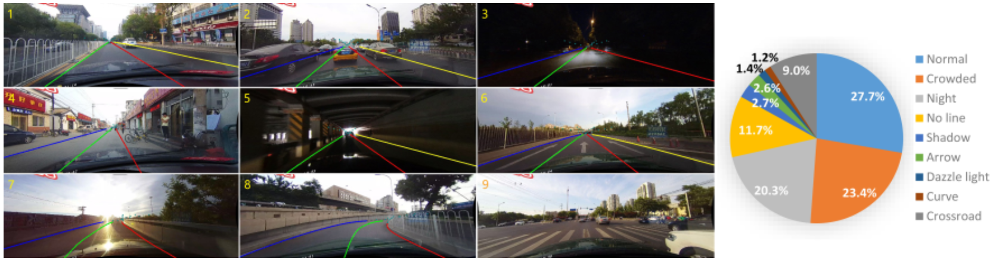

# CULane Dataset Processing Script

## Overview

CULane is a large-scale lane detection dataset specifically designed for autonomous driving research. It consists of images captured from a car-mounted camera moving in Beijing, China, under various real-world scenarios, including urban traffic, highways, and challenging weather conditions. This script processes the CULane dataset to generate normalized annotations, drivable paths, and segmentation masks for lane detection tasks.



---

## Functions

### `normalizeCoords(lane, width, height)`
- **Description**: normalizes lane coordinates to a scale of `[0, 1]` based on image dimensions.
- **Parameters**:
  - `lane` (list of tuples): list of `(x, y)` points defining a lane.
  - `width` (int): width of the image.
  - `height` (int): height of the image.
- **Returns**: a list of normalized `(x, y)` points.

---

### `getLaneAnchor(lane)`
- **Description**: determines the "anchor" point of a lane, which is used to identify ego lanes.
- **Parameters**:
  - `lane` (list of tuples): list of `(x, y)` points defining a lane.
- **Returns**: a tuple containing the anchor `(x0, a, b)` for the lane, where `x0` is the x-coordinate at the bottom of the frame, and `(a, b)` are slope and intercept of the lane equation.

---

### `getEgoIndexes(anchors)`
- **Description**: identifies the left and right ego lanes from a list of lane anchors.
- **Parameters**:
  - `anchors` (list of tuples): list of lane anchors.
- **Returns**: a tuple `(left_ego_idx, right_ego_idx)` of the indexes of the two ego lanes, or a warning message if insufficient lanes are detected.

---

### `getDrivablePath(left_ego, right_ego)`
> [!Note]
> This function is not used, kept for future need.
- **Description**: computes the drivable path as the midpoint between the two ego lanes.
- **Parameters**:
  - `left_ego` (list of tuples): points defining the left ego lane.
  - `right_ego` (list of tuples): points defining the right ego lane.
- **Returns**: a list of `(x, y)` points representing the drivable path.

---

### `annotateGT(anno_entry, anno_raw_file, raw_dir, visualization_dir, mask_dir, img_width, img_height, normalized=True, crop=None)`
- **Description**: annotates and saves images with lanes, ego/outer paths, and binary masks.
- **Parameters**:
  - `anno_entry` (dict): normalized annotation data.
  - `anno_raw_file` (str): path to the raw image file.
  - `raw_dir` (str): directory for saving raw images.
  - `visualization_dir` (str): directory for saving annotated images.
  - `mask_dir` (str): directory for saving binary masks.
  - `img_width` (int): width of the processed image.
  - `img_height` (int): height of the processed image.
  - `normalized` (bool): if `True`, annotations are normalized.
  - `crop` (dict): Crop dimensions in the format `{"TOP": int, "RIGHT": int, "BOTTOM": int, "LEFT": int}`.
- **Returns**: none.

---

### `parseAnnotations(anno_path, crop=None)`
- **Description**: parses lane annotations and extracts normalized ground truth data.
- **Parameters**:
  - `anno_path` (str): path to the annotation file.
  - `crop` (dict): crop dimensions in the format `{"TOP": int, "RIGHT": int, "BOTTOM": int, "LEFT": int}`.
- **Returns**: a dictionary containing normalized lanes, ego indexes, and drivable path, or `None` if parsing fails.

---

## Usage

### Args
- `--dataset_dir`: path to the CULane dataset directory.
- `--output_dir`: path to the directory where processed outputs will be saved.
- `--crop`: optional. Crop dimensions as `[TOP, RIGHT, BOTTOM, LEFT]`. Default is `[0, 390, 160, 390]`.
- `--sampling_step`: optional. Sampling step for each split/class. Default is `5`.
- `--early_stopping`: optional. Stops after processing a specific number of files for debugging purposes.

## Running the script

```bash
python process_culane.py --dataset_dir /path/to/CULane --output_dir /path/to/output