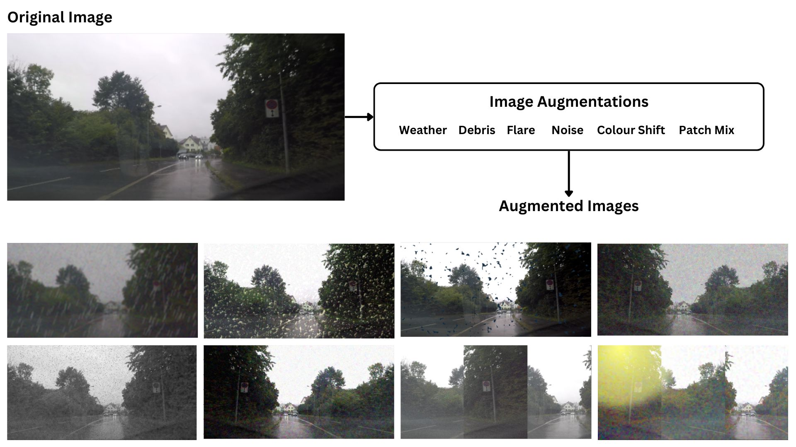

## augmentations.py
Image augmentation is an essential part of training visual neural networks. It helps harden the network to various noise effects during training and helps to reduce data over-fitting. The [albumentations library](https://albumentations.ai/) is used to create different image augmentations effects simulation weather, debris, lens effects, noise, colour shifting, and mixing of image patches



## check_data.py
Script to perform a sanity check on data for processing, ensuring that data is read and that number of ground-truth samples match the number of training images

## load_data_scene_seg.py
Helper class for the [SceneSeg Neural network](https://github.com/autowarefoundation/autoware.privately-owned-vehicles/tree/main/SceneSeg) to load multiple datasets, separate data into training and validation splits and extract a Region of Interest (ROI) from images

## load_data_scene_3d.py
Helper class for the [Scene3D Neural network](https://github.com/autowarefoundation/autoware.privately-owned-vehicles/tree/main/Scene3D) to load dataset and separate data into training and validation splits

## load_data_ego_path.py

Helper class for the [EgoPath detection network](https://github.com/autowarefoundation/autoware.privately-owned-vehicles/tree/main/EgoPath) to load multiple datasets, separate data into training and validation splits, before feeding them into the network training.

Please note that in order for `LoadDataEgoPath` class to work properly, the label JSON file must be in the structure of:

```json
{
  <frame_code_1>: {
    "drivable_path": [
      [<x_1>, <y_1>],
      [<x_2>, <y_2>],
      [<x_3>, <y_3>],
      .............
      [<x_n>, <y_n>],
    ],
    .................
  },
  <frame_code_2>: {
    "drivable_path": [
      [<x_1>, <y_1>],
      [<x_2>, <y_2>],
      [<x_3>, <y_3>],
      .............
      [<x_n>, <y_n>],
    ],
    .................
  },
  ...................
```

## benchmark.py
Script to print model layers, number of parameters, and measure inference speed of model at either FP32 or FP16 precision.

### Example usage
```bash
  python3 benchmark.py -n SceneSeg -p fp32
```
### Parameters:

*-n , --name* : name of the network (SceneSeg, Scene3D)

*-p , --precision* : precision of the network at which to perform benchmarking (fp32, fp16)
