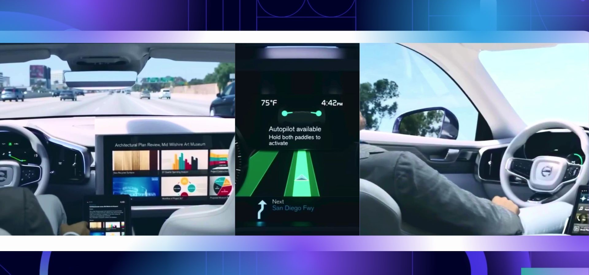
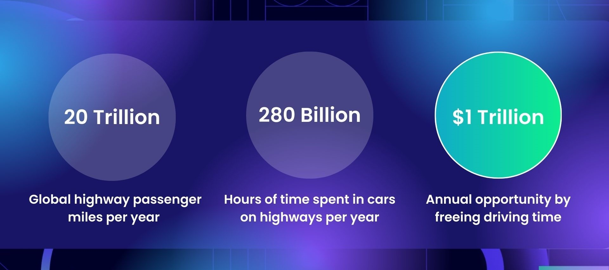
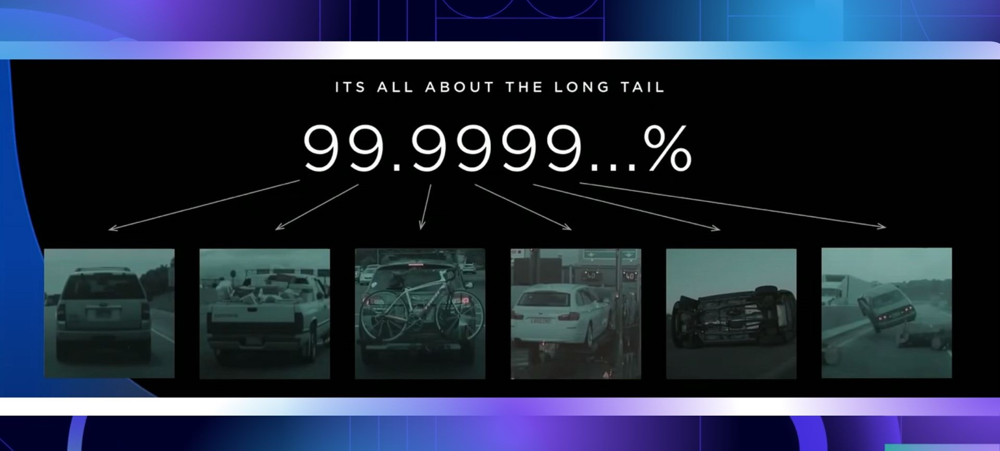
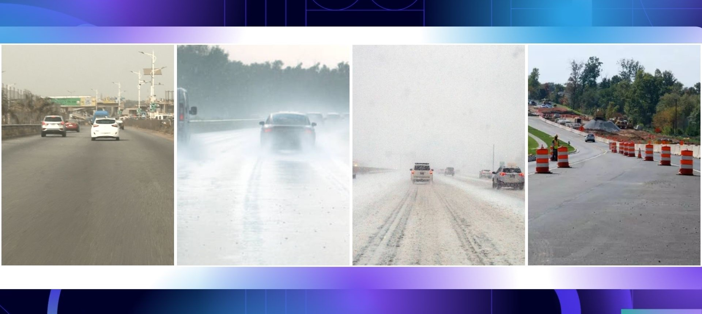
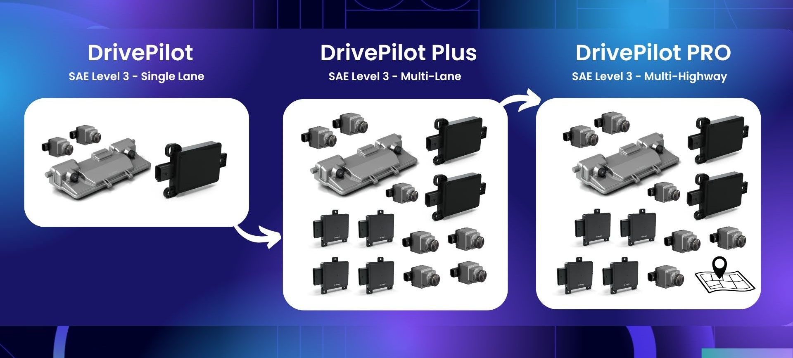

# Autoware - Autonomous Highway Pilot

The goal for this effort in Autoware is to build an open-source highway autonomy system that can power safe, SAE Level 4, autonomous driving around the world. To learn more about how to participate in this project, please read the [onboarding guide](/ONBOARDING.md)

 

## Value Proposition
It is estimated that over **20 Trillion** passenger miles are driven on highways around the world, each year. This equates to **280 Billion** hours of driver time spent behind the wheel. If an autonomous driving technology could be developed to a sufficiently advanced level such that people did not need to manually drive on highways, and could do other activities with their time, then this would unlock a **$1 Trillion/annum** market opportunity, if we were to simply cost the time of a person at around $4/hour (conservative estimate).

 

## Limitations of Existing Technologies
Current autonomous highway pilot systems face challenges in achieving the safety and performance requirements for true hands-off, eyes-off, self-driving, where the human driver no longer has to pay attention to the road or be engaged with the driving task. Specifically, there are two areas where autonomous driving technologies are currently lacking: obstacle perception for out of domain objects, and driving corridor perception in challenging scenarios.

### Obstacle Perception Challenge
Highway pilot systems typically rely upon vision (cameras), and RADAR as primary sensors.

RADAR is a highly useful sensor in detecting moving obstacles at long range in all weather and lighting conditions, especially other moving vehicles. However, RADAR sensors suffer from frequent false-positive detections for static objects. This is often caused by ground-reflections, multi-path reflections, and sensor noise. This means that it is not possible to reliably use existing off-the-shelf automotive RADAR to reliably detect all obstacles in the driving scene as static objects cannot be distinguished from noise.

To complement RADAR, highway pilot systems utilize vision technologies. These usually consist of AI-powered bounding-box detectors or semantic segmentation systems that attempt to classify objects by their type - e.g. cars, buses, vans, trucks, pedestrians, etc.

Typically, the obstacle detection logic in highway pilot systems is as follows:
- Moving object detected in RADAR - Treated as True Positive
- Moving or static objected detected in vision - Treated as True Positive
- Static object detected only in RADAR - Treated as Noise

This leaves a **blindspot in obstacle perception for long-tail edge case scenarios**, where, if a static object is not detected by the vision system, then the detection is ignored by the autonomous vehicle. Such edge-case scenarios are caused by out-of-domain objects that occur rarely in driving scenes, such as fire trucks, police cars, ambulances, an animal crossing the road, etc. or strange presentations of known objects, e.g. a vehicle that has over-turned on the highway. **There are many publicly documented examples of accidents that have occured with autonomous vehicles in exactly these types of driving scenarios.** 

 

#### Obstacle Perception Solution
To address this challenge, we aim to develop a **Safety Shield** for self-driving cars that can reliably and robustly detect every obstacle in the driving scene, irrespective of what that object is, whether it is a static or moving object, across all weather and lighting conditions, even if the self-driving car has never seen such an object type or object presentation before. 

Many developers feel that the way to address this challenge is to utilize LIDAR - however, LIDAR sensors suffer from severe noise in rain, snow and fog, making them unusable in these weather conditions and unable to address the obstacle perception challenge. Therefore, we will utilize vision as the primary sensor, alongside RADAR - however, we will utilize vision to not only detect objects using AI, but we will also utilize vision to calculate true metric depth of the driving scene and develop a best-in-class VIDAR (vision-LIDAR) that works at long-range and can reliably measure depth in those weather conditions where LIDAR struggles. We will also utilize state-of-the-art 4D Imaging Radar to have RADAR sensing with greater resolution allowing stronger noise filtering, enabling us to more reliably detect static objects in RADAR alone.

Our **Safety Shield** will be comprised of three layers:
- **Sentry** - Imaging RADAR obstacle detection using 4D pointclouds
- [**SceneSeg**](/SceneSeg/README.md) - Vision based AI-powered segmentation of all obstacles
- [**SuperDepth**](/SuperDepth/README.md) - VIDAR based obstacle detection using 3D pointclouds

We will additionally detect, classify and track objects based on their semantic class in the 3D scene through an independent vision and 4D Radar pipeline, called **Drive3D**.

Overall, our obstacle perception stack will comprise two key perception pipelines which will operate independently to provide unparalleled scene perception:
- **Safety Shield** - to detect every object in the scene with the aim to never have an at-fault autonomous vehicle crash
- **Drive3D** - a robust 3D detection, classification, and tracking system to understand the scene context of commonly occuring road objects such as cars, buses, vans, trucks, etc.

### Driving Corridor Perception Challenge
Existing highway pilot systems can reliably detect the driving corridor through lane lines. Lane line perception can be performed through either AI-based methods or Computer Vision methods, achieving performance on-par with human drivers. However, highway pilot systems struggle to detect the driving corridor in safety-critical edge case scenarios, such as situations where lanes are no longer visible due to road maintenance issues, snow, etc. and scenarios where the driving corridor is highly adaptable, e.g. roadworks with traffic cones and road barriers. **There are many publicly documented examples of accidents that have occured due to autonomous vehicles failing to perceive the correct driving corridor in these types of edge case scenarios.**

 

#### Driving Corridor Perception Solution
To solve the driving corridor perception challenge, we will develop a universal driving path detection system called **Path Finder**, using two independent driving corridor perception technologies:

**Path Finder** will be comprised two layers:
- [**LaneDet**](/LaneDet/README.md) - lane line detection
- [**PathDet**](/PathDet/README.md) - end-to-end prediction of driving corridors on roads with and without lanes and also during road works

By using an ensemble approach, **Path Finder** will be able to robustly tackle edge case driving scnearios and ensure autonomous vehicle safety.

## High Definition Maps
**We will not utilize 3D high definition prior maps**, instead opting to use existing 2D navigational (sat-nav style) maps, also called ADAS maps. Human beings can drive on highways without prior knowledge of the detailed 3D geometry of roadways by relying on real-time scene perception, and our system aims to mimic this process.

## End-to-End AI Architecture
We will follow an **End-to-End AI Architecture** in which each component technology of the highway pilot system is powered through neural-network. We will follow a modular AI approach with component AI systems allowing for system explainability, introspection and diagnostics.

### Vision Pipeline
The [**AutoSeg foundation model**](/AutoSeg/README.md) is currently being developed as part of the vision pipeline of the Autoware Privately Owned Vehicle Highway Pilot System. It includes the development and implementation of **SuperDepth**, **SceneSeg**, **LaneDet** and **PathDet**.

## Technology Roadmap

### Goal
We will aim to develop true hands-off, eyes-off autonomous driving which is enabled on highways across the world, this will be classified as SAE Level-4 autonomy, where no human supervision is required of the vehicle.

### Technology Release Cycle
We will iteratively and sequentially build the core software stack of the highway pilot system in a modular manner, and release versions of the autonomous highway pilot system that serve a core customer need, where each new release and expands upon the operational-design-domain, technology prowess and safety of the prior release.

As part of our technology roadmap, we will sequentially develop four versions of the Autoware Autonomous Highway Pilot System, called **DrivePilot**, **DrivePilot Plus**,  **DrivePilo tPro** and **DriveChauffeur**

 

### *DrivePilot*
DrivePilot will enable SAE Level-3 autonomy over the full range of highway driving speeds (0 - 70mph). The system will be constrained to single lane driving (no lane changes, exits, on-ramps, roadworks), and will be operable on roads with clearly visible lanes. If these road conditions (ODD) are violated, then the system will perform a safe handover of control to the human driver, and if a handover is not possible, then the system will perform a Minimal Risk Manoeuvre to transition the self-driving car to as a safe state as is possible within its operational design domain. DrivePilot's sensing suite will comprise two front-facing cameras, a main camera, as well as a long-range camera. Additionally, the system will integrate a front-facing 4D Imaging Radar.

### *DrivePilot Plus*
DrivePilot Plus will enable SAE Level-3 autonomy over the full range of highway driving speeds (0 - 70mph), and will build on top of the functionality of DrivePilot to enable fully autonomous lane changes - exits/ramps will be outside of the operational domain of the system. To enable autonomous lane changes, DrivePilot Plus will additionally utilise surround view cameras, and corner RADAR sensors to have 360 degree vision and RADAR sensing coverage. Additionally, the system will also integrate a rear-facing 4D Imaging Radar.

### *DrivePilot PRO*
DrivePilot PRO will enable SAE Level-3 autonomy over the full range of highway driving speeds (0 - 70mph) for an entire highway journey, including fully autonomous lane changes, exits, and on/off-ramps - being able to traverse multiple distinct connected highways without any human intervention or guidance. To enable autonomous driving of an entire highway journey, DrivePilot PRO will be integrated with 2D/ADAS maps to have more detailed road context and prior information about highway road layouts for navigational purposes.

### *DriveChauffeur*
DriveChauffeur will enable SAE Level-4 autonomy over the full range of highway driving speeds (0 - 70mph) for an entire highway journey, including fully autonomous lane changes, exits, and on/off-ramps without any requirement for human supervision or manual control. In order to ensure system safety and robustness, DriveChauffeur will additionally integrate Short-Wave-Infrared as well as Long-Wave-Infrared front facing cameras which will allow the vehicle to see through fog, dust, haze, smoke and see clearly in pitch-black conditions. This hyper-spectral imaging will enable DriveChauffeur to drive match or exceed human safety performance of the driving task.