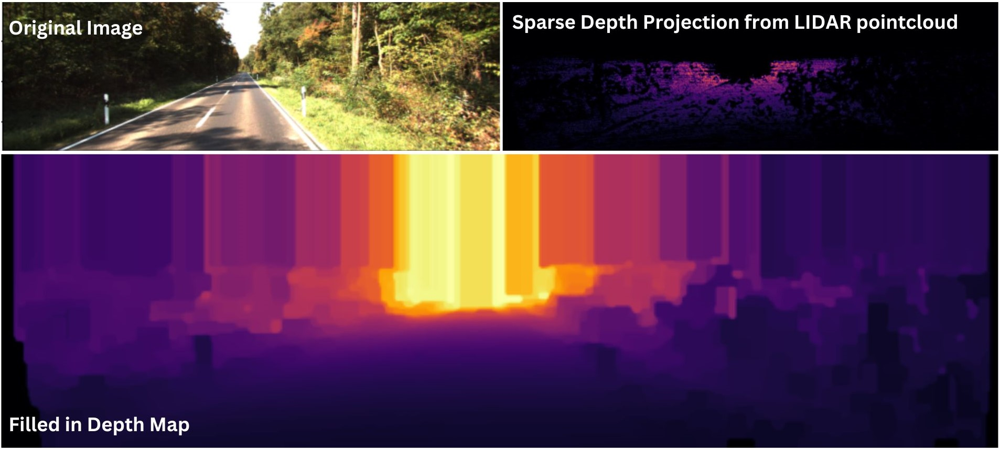

## lidar_depth_fill.py
In order to train the SuperDepth network, we require ground truth depth maps. In real world datasets, ground druth depth maps are acquired by LIDAR scanners, resulting in sparse virtual depth maps created by proejction of 3D lidar points onto in image, where, in most cases, depth data is only available for 5% of pixels. This script creates a fully filled in lidar depth map based on the method [In Defense of Classical Image Processing: Fast Depth Completion on the CPU](https://arxiv.org/abs/1802.00036)

## Important Note
However, one modification ws made to the above method, wherein extrapolation of data to the top of the image based on a fixed depth assumption was not applied, leaving the top section of the image empty where depth data was unavailable.

