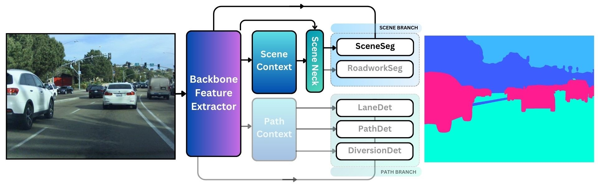

## SceneSeg
The SceneSeg Neural Expert performs Semantic Scene Segmentation of Stuff Categories. It is aims to learn scene level feature representations that generalize across object types. For example, rather than explicitly learning features to recognise cars from buses, SceneSeg is able to recognise high level features that can implicitly distinguish any movable foreground object from the static background, and drivable road surface. This provides an autonomous vehicle with a core safety layer since SceneSeg can comprehend strange presentations of known objects and previously unseen object types, helping to address 'long-tail' edge cases which plauge object-level detectors.

Semantic Classes

- All Movable Foreground Objects
- All Static Background Elements
- Drivable Road Surface

## Performance Results
SceneSeg was trained on a diverse dataset comprised of multiple open-source datasets, including ACDC, MUSES, IDDAW, Mapillary Vistas and the Comma10K datset. These datasets provide challenging training data covering a wide range of countries, road types, lighting conditions and weather conditions. The BDD100K dataset was not used during training and served as a broad and diverse test set.

Mean Intersection Over Union (mIoU) scores are provided for both validation and test data. Validation results are provided for each of the datasets which comprise the complete validation set, alongside the results for the entire validation set, which are presented in the Cross Dataset column. Per-class mIoU scores are provided, alongside mIoU averaged across classes, as well as an Overall mIoU score which calculates the mIoU between the full multi-class prediction and multi-class ground truth.

### Validation Set Performance - mIoU Scores
|| Cross Dataset | Mapillary| MUSES | ACDC | IDDAW | Comma10K |
|--------|---------------|------------------|-------|------|-------|----------|
| Overall | **90.7** | 91.1 | 83.7 | 89.3 | 87.2 | **92.5** |
| Static Background Elements | **93.5** | 93.7 | 89.1 | 93.2 | 90.0 | **95.1** |
| Movable Foreground Objects | **58.2** | **60.9** | 35.7 | 46.9 | 58.6 | 58.9 |
| Drivable Road Surface | **84.2** | 85.7 | 70.8 | 74.4 | 81.8 | **86.3** |
| Class Average | **78.6** | **80.1** | 65.2 | 71.5 | 76.8 | **80.1** |

### Test Set Performance - mIoU Scores
|| BDD100K |
|-|---------|
| Overall | **91.5** |
| Static Background Elements | **94.3** |
| Movable Foreground Elements | **69.8** |
| Drivable Road Surface | **71.3** |
| Class Average | **78.5** |

## create_masks

Contains scripts to process open datasets and create semantic masks in a unified labelling scheme according to the SceneSeg neural task specification. 

Open semantic segmentation datasets contain various labelling methodologies and semantic classes. The scripts in create_masks parse data and create semantic colormaps in a single unified semantic format.

Colormap values for unified semantic classes created from training data are as follows:

| SceneSeg Semantic Class             | SceneSeg RGB Label                             |
| ----------------- | ------------------------------------------------------------------ |
| Sky |  rgb(61, 184, 255)|
| Background Objects |  rgb(61, 93, 255)|
| Foreground Objects |  rgb(255, 28, 145) |
| Vulnerable Living |  rgb(255, 61, 61)|
| Small Mobile Vehicle |  rgb(255, 190, 61)|
| Large Mobile Vehicle |  rgb(255, 116, 61) |
| Road Edge Delimiter |  rgb(216, 255, 61)|
| Road |  rgb(0, 255, 220) |

#### The open datasets used in SceneSeg include:
- [ACDC](https://acdc.vision.ee.ethz.ch/)
- [MUSES](https://muses.vision.ee.ethz.ch/)
- [IDDAW](https://iddaw.github.io/)
- [BDD100K](https://www.vis.xyz/bdd100k/)
- [Mapillary Vistas](https://www.mapillary.com/dataset/vistas)
- [comma10K](https://github.com/commaai/comma10k)

#### Please note: 
All of the open datasests besides comma10K include semantic labels for specific foreground objects:
- `Vulnerable Living`
- `Small Mobile Vehicle`
- `Large Mobile Vehicle`

These classes were unified during training into a single class for `Foreground Objects`

The comma10K dataset already provides a single class label for `Foreground Objects` which includes all movable foreground elements such as pedestrians, vehicles, animals etc. 

The comma10K dataset does not include labels for `Road Edge Delimeter`. During training, this class was unified across all datasets into the `Background Objects` class

The comma10K dataset does not natively provide `Sky` class semantic pixel labels and a separate pre-trained neural network was used to create pixel level sky masks for the comma10K images.

It was found that there was data inconsistency between `Background Objects` and `Sky` class labels across the data, particularly in night-time scenes, therefore during training, the `Sky` class was merged into the `Background Objects` class