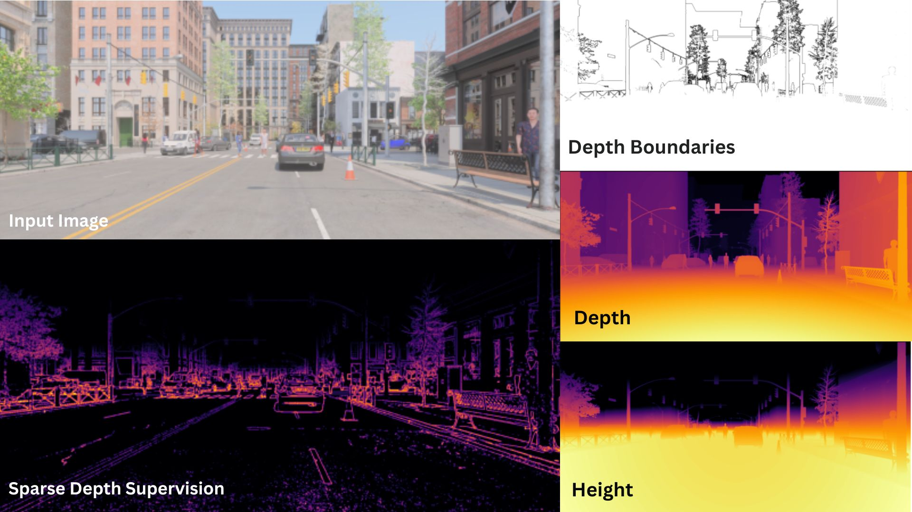

## SuperDepth Dataset
To train the SuperDepth network, a custom dataset was created using a number of open-source, publicly available datasets which capture scene depth through simulation, LIDAR or a combination of LIDAR and Stereo Vision.

The SuperDepth dataset includes RGB images, ground truth depth maps, ground truth height maps, foreground-background object boundary masks as well as sparse depth supervision input. The sparse depth supervision input is calculated either through sparse stereo matching, or by simulating sparse stereo features by analyzing image and depth data.

The datasets used to train SuperDepth include:

- [Argoverse](https://www.argoverse.org/av1.html#stereo-link)
- [GTAV](https://github.com/ostadabbas/Temporal-controlled-Frame-Swap-GTAV-TeFS-/tree/main)
- [KITTI](https://www.cvlibs.net/datasets/kitti/eval_depth.php?benchmark=depth_prediction)
- [MUSES](https://muses.vision.ee.ethz.ch/)
- [MUAD](https://muad-dataset.github.io/)
- [UrbanSyn](https://www.urbansyn.org)

## common
Contains helper classes to hcreate ground truth data